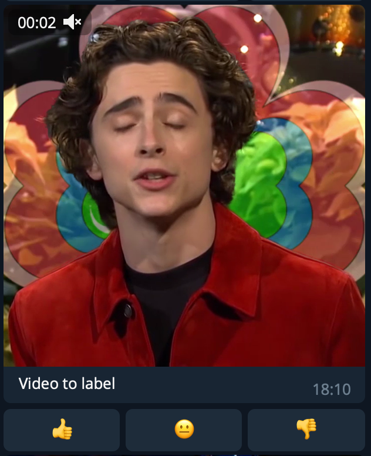

# Label Bot via Telegram

### The easiest way to label your videos or images using Telegram Bot API


<br/>

# Description
* Easy to modify: all code is in `LabelBot.py`
* All results stored in `label-results.log` file:
```bash
2022-05-27 10:57:27,661 INFO yes 6c290b609b96fedf5d72aea18bb2e33e UserName
2022-05-27 10:57:32,618 INFO yes 17ff44462ac8de91a07a98fca159a91a UserName2
2022-05-27 10:57:40,040 INFO no e2ad5afb0d811071806a118ca0b566a9 UserName
2022-05-27 10:57:45,166 INFO isok a9b2e491ae8607c2bc65250dd3f6f4b2 UserName3
```

* where `{'yes', 'no', 'isok'}` is the label
* where `a9b2e491ae8607c2bc65250dd3f6f4b2` is the video id. See `get_hash` function and `files-MMDD.json` file
* where `UserName` is the user name

# How to use
* Replace bot token in `tokens.yaml` file
* Edit `BASE_DIR` constant and check `LabelBot.py:71` to find video files
```python3
VIDEOS = list(Path(BASE_DIR).rglob("**/*.mp4"))`
```
* Run `python3 LabelBot.py`